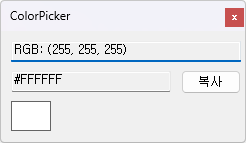

# ColorPicker 🎨

ColorPicker는 Windows Forms 기반의 간단한 색상 추출 도구입니다.  
화면의 특정 지점을 클릭하면 해당 위치의 색상을 추출하고, RGB 및 HEX 값을 확인할 수 있습니다.

## ✨ 기능 소개

- 화면에서 마우스 클릭으로 색상 추출
- 추출된 색상의 RGB 및 HEX 코드 확인
- 복사 기능 지원 (예: 클립보드로 HEX 복사)
- 심플하고 직관적인 UI

## 🛠️ 기술 스택

- C# (.NET Framework 4.8)
- Windows Forms (WinForms)
- Visual Studio 2022 이상 권장

## 📸 스크린샷



## 🚀 실행 방법

1. Visual Studio로 `ColorPicker.sln` 열기
2. `F5` 또는 `Ctrl + F5`로 실행

## 📂 프로젝트 구조
```
ColorPicker/
├── Form1.cs                # 메인 폼 로직
├── Program.cs              # 앱 진입점
├── Properties/             # 리소스 및 설정 파일
├── bin/, obj/              # 빌드 산출물 (Git에서 제외됨)
└── ColorPicker.sln         # 솔루션 파일
```

## 📄 라이선스

이 프로젝트는 [MIT License](LICENSE)를 따릅니다.


## ⚠️ 백신 오탐지 관련 안내

일부 보안 솔루션(Microsoft Defender, Malwarebytes 등)에서 `ColorPicker.exe` 파일을 **오탐(False Positive)**으로 인식할 수 있습니다.

- VirusTotal 검사 결과: `4/72` 엔진이 탐지
- 탐지명 예: `Trojan:Win32/Sabsik.FL.A!ml`, `MachineLearning/Anomalous`
- 이는 대부분 **자체 제작된 WinForms 실행 파일의 일반적인 오탐 사례**입니다.

📌 해당 파일은 실제로는 악성코드가 아니며, [VirusTotal 결과 보기](https://www.virustotal.com/gui/file/d4a3c1d90f9ce88c1ec8a0a3aa3e73bda8165e2b081a75b54bcf610a60ac1319)에서 확인하실 수 있습니다.

⚙️ 필요 시 실행 파일 대신 Visual Studio로 직접 빌드해서 사용하는 것을 권장합니다.